# F1 Fantasy 真实历史赛季本地游戏开发方案 (基于 FastF1 数据驱动)

本方案设计了一款完全取材于真实世界历史数据（2018-2025年大奖赛）的 F1 梦幻车队本地单页游戏。我们抛弃任何“虚拟模拟数据”，使用 Python `fastf1` 库将真实赛季的每一场排位赛、冲刺赛、正赛、退赛状况及进站时间清洗并导出为轻量级 JSON 数据库，从而在 React 前端实现 120 FPS 丝滑且数据绝对真实的历史 F1 Fantasy 复刻游玩体验。

---

## 1. 系统架构与数据流设计

由于 `fastf1` 是一个大型的 Python 科学计算库（包含数吉字节的遥测缓存且数据抓取缓慢），直接在浏览器端实时请求 `fastf1` 既不现实也无法保证流畅度。因此，我们采用 **“离线编译数据 + 前端高性能渲染”** 的混合型架构：

```mermaid
flowchart TD
    A[FastF1 API Python 端] -->|scripts/fetch_season_data.py| B[赛季 JSON 数据库 src/data/seasons/]
    B -->|2018.json ~ 2025.json| C[React 游戏引擎 Context API]
    C -->|读取当前 round 真实结果| D[赛会控制台 Race Control]
    C -->|阵容预算校验 / 动态身价算法| E[交易中心 Transfer Center]
    C -->|AI 策略更新| F[3名 AI 经理对手]
    C -->|数据渲染与 SVG 折线图| G[仪表盘 & 积分榜]
    
    style B fill:#15151F,stroke:#E10600,stroke-width:2px
    style C fill:#1D1D26,stroke:#00F0A0,stroke-width:2px
```



### 1.1 数据提取脚本 (`scripts/fetch_season_data.py`)
我们将在项目中编写一个高度自动化的 Python 脚本，通过 `fastf1` 抓取指定赛季（如 2024 赛季）的全部数据并生成 JSON 文件。JSON 数据中将仅保留 Fantasy 结算所需的数据，以保持极致小巧（每赛季约 40-70KB）。

#### 提取的赛会数据格式示例：
```json
{
  "season": 2024,
  "rounds": [
    {
      "round": 1,
      "raceName": "Bahrain Grand Prix",
      "country": "Bahrain",
      "isSprint": false,
      "qualifying": {
        "results": [
          {"driver": "VER", "team": "Red Bull Racing", "position": 1, "q1": "1:30.031", "q2": "1:29.374", "q3": "1:29.179", "status": "Finished"},
          {"driver": "HAM", "team": "Mercedes", "position": 9, "q1": "1:30.393", "q2": "1:29.718", "q3": "1:29.710", "status": "Finished"}
        ]
      },
      "race": {
        "results": [
          {"driver": "VER", "grid": 1, "position": 1, "status": "Finished", "points": 25},
          {"driver": "HAM", "grid": 9, "position": 7, "status": "Finished", "points": 6}
        ],
        "fastestLapDriver": "VER",
        "pitStops": [
          {"constructor": "Red Bull Racing", "minDuration": 21.84},
          {"constructor": "Mercedes", "minDuration": 22.31}
        ]
      }
    }
  ]
}
```

---

## 2. 三个 AI 经理个性化转会算法

为了让本地游戏充满挑战，游戏将内置 3 名不同性格与交易倾向的 AI 竞争经理，他们在每站比赛锁定时，会自动评估阵容并消耗转会额度：

1.  **AI 经理 1 (The Fanatic - 豪门拥趸)**
    *   **交易偏好**：极端信任顶级豪门车队（Red Bull, Ferrari, McLaren, Mercedes AMG）。
    *   **策略特点**：宁愿在 4/5 号车手位选择最便宜的下位垫底车手（“省钱工具人”），也要在车队位和 1/2 号车手位塞满最贵的高分车手。DRS 永远指定队内身价最高者。
2.  **AI 经理 2 (The Value Trader - 数值精算师)**
    *   **交易偏好**：基于 **「性价比（Points per Million）」** 与 **「积分 Form（平均分）」** 进行买卖。
    *   **策略特点**：当某位车手连续两站超常发挥但身价还未暴涨时，AI 会以最快速度抛售贬值资产购入该车手。在阵容平衡性上表现完美。
3.  **AI 经理 3 (The Wildcard / Underdog - 逆风狂热者)**
    *   **交易偏好**：专挑发车顺位较低但正赛追赶能力极强的中游车手。
    *   **策略特点**：充分挖掘排位赛失误但正赛有能力向前追赶的选手，以压榨“位置提升积分 (Positions Gained)”。他们通常会保留充足的资金，并在混乱赛道（如巴库）高频启用免受负分（No Negative）芯片。

---

## 3. 核心界面设计与交互

整个本地 React SPA 采用纯Vanilla CSS编写，打造震撼的 F1 暗黑色系毛玻璃视觉系统。

### 3.1 首页仪表盘 (Dashboard)
*   以拟真的 F1 车房排位展现 5 名车手和 2 支车队。
*   顶部滚动显示当前选定赛季（如 `2024 SEASON`）的历史总积分排行、预算和剩余特权芯片。
*   动态展示本站比赛的信息（例如：`ROUND 12: Silverstone - British GP`）。

### 3.2 阵容转会中心 (Transfer Center)
*   **拖拽/点击式操作**：轻松替换车手与车队。
*   **财务实时联动**：动态更新可用资金。如果超出预算或超出免费转会次数，转会按钮会变红并显示警告（如：`Budget exceeded by $1.2M` 或 `Extra transfers penalty: -20 pts`）。
*   **常规每周加成**：提供 DRS 选择器，**每周每支经理车队均可且必须使用一次**，为阵中一名车手指定 DRS Boost（双倍积分）。
*   **特权卡包 (Chips Panel)**：在锁定前可选择激活六大单项特权芯片（Limitless、Wildcard、Extra DRS 等，每种赛季限用一次，每周最多激活一个）。

### 3.3 赛会控制台 (Race Control - 核心玩法推进)
这是将游戏从本站推向下一站的控制中心。
*   由于我们使用真实数据，这里**无需任何虚拟模拟**！
*   控制台会展示本站比赛的真实数据摘要（排位赛前三、正赛前三、退赛名单、最快圈车手、最快进站车队）。
*   点击 **“结算本周并推进大奖赛 (Lock & Process Weekend)”** 按钮后，系统执行以下自动计算：
    1.  依据 FastF1 导出的实际结果，为您和 3 位 AI 经理计算 Fantasy 分数。
    2.  应用 常规 DRS Boost、Extra DRS（3倍分）、Autopilot（DRS自动纠错转移给最高分车手）。
    3.  应用 No Negative 芯片（如果有负分成员，将其置为 0）。
    4.  计算过去三站平均 Form 值，并更新 20 名车手和 10 支车队的市场价格！
    5.  如果是 Limitless 芯片，在结算后自动回滚车队阵容为使用前的状态。
    6.  推进赛季进度到下一站。

### 3.4 积分榜与折线图 (Standings & Analytics)
*   **积分天梯榜**：实时显示您与 3 位 AI 对手的名次争夺战。
*   **SVG 历史折线图**：展示所有经理在整个赛季中的积分累加走势，带发光发热的曲线（F1 Red, Neon Cyan, Neon Green, Gold 色彩体系），提供直观且高端的数据美感。

---

## 4. 本地项目开发目录结构规划

我们将在 `d:\Tangerin\Personal\Code\F1 Fantasy` 目录中建立如下规范的目录布局：

```text
F1 Fantasy/
├── f1_fantasy_rules.md      # 游戏适配版积分规则
├── implementation_plan.md   # 本开发计划文档
├── package.json             # 前端项目配置
├── vite.config.ts           # Vite 配置
├── scripts/
│   └── fetch_season_data.py # Python 数据导出脚本 (依赖 fastf1, pandas)
└── src/
    ├── main.tsx             # 应用入口
    ├── index.css            # 全局高级 CSS 变量与主样式
    ├── data/
    │   ├── initial_assets.ts# 2018-2025车手车队静态属性、初始定价
    │   └── seasons/         # 存储由 Python 脚本生成的 2018-2025.json
    ├── context/
    │   └── GameContext.tsx  # 游戏全局状态管理器 (Season, Round, Managers, Scoreboard)
    ├── components/          # 可复用组件 (DriverCard, Navigation, ChipBadge)
    └── views/               # 主页面视图
        ├── Dashboard.tsx    # 经理仪表盘
        ├── Transfer.tsx     # 交易市场与阵容构建
        ├── Standings.tsx    # 联赛季分榜与折线图
        └── RaceControl.tsx  # 真实赛会结算控制台
```

---

## 5. 本地开发环境配置 (Local Environment Setup)

为了成功运行本项目，您需要在本地配置以下两种运行环境：

### 5.1 Python 数据导出环境 (获取 F1 真实数据)
用于在后台/命令行运行 `scripts/fetch_season_data.py` 从 F1 官方提取历史赛季数据并写入前端。
1.  **Python 安装**：建议安装 **Python 3.8 或更高版本** (可在命令行运行 `python --version` 确认)。
2.  **核心库依赖**：
    *   **`fastf1`**：获取 F1 历史排位、正赛、进站数据的核心科学计算库。
    *   **`pandas`**：数据清洗与结构化输出。
    *   *安装命令*：`pip install fastf1 pandas`
3.  **网络与缓存要求**：
    *   运行 Python 数据下载脚本时**需要互联网连接**。FastF1 会从官方服务器下载大量遥测和计时日志。
    *   脚本中会**自动启用本地硬盘缓存** (如 `fastf1.Cache.enable_cache('scripts/f1_cache')`)。缓存建立后，再次导出同赛站数据将实现秒级即时读取，避免重复下载。
    *   *说明*：一旦 Python 脚本成功导出了各赛季的 JSON 文件，**前端运行游戏将完全处于离线状态，不再需要任何 Python 环境和外部网络**。

### 5.2 前端网页运行环境 (游玩 F1 Fantasy 游戏)
用于运行前端 React 单页应用进行日常游戏。
1.  **Node.js 安装**：建议安装 **Node.js 18.0 或更高版本** (可在命令行运行 `node -v` 确认，通常伴随 `npm`)。
2.  **前端依赖项**：
    *   项目基于 **Vite + React + TypeScript** 构建，零重型外部依赖。
    *   *运行指令*：在项目根目录运行：
        *   安装依赖：`npm install`
        *   启动本地开发服务器：`npm run dev`
3.  **浏览器环境**：现代主流浏览器 (Chrome, Edge, Safari, Firefox)。

---

## 6. 验证与部署方案

### 6.1 自动化测试验证
*   **积分比对验证**：我们将在数据清洗脚本中嵌入一段核对程序，确保对于同一个 Race Week，清洗导出的数据套入我们设计的积分公式后算出的车手得分，与人工对齐的数据一致。
*   **身价边界验证**：跑完一整季 2024 赛季，打印身价最高和身价最低的车手价格，确保身价波动在预期轨道内（不会降到 $3M 以下，不会涨过 $35M）。

### 6.2 本地运行命令
1.  **准备数据**：在本地运行 Python 脚本导出赛季 JSON：
    ```bash
    pip install fastf1 pandas
    python scripts/fetch_season_data.py --season 2024
    ```
2.  **启动前端**：
    ```bash
    npm install
    npm run dev
    ```

---

## 7. 确认与反馈

> [!IMPORTANT]
> **确认您的批准**：
> 本方案完全抛弃了模拟算法，改由真实的 FastF1 API 历史赛季数据驱动，并在本地引入 3 名自动博弈的 AI 经理，大幅提升了游戏耐玩性与技术含金量。
> 
> 如果您对本实现方案以及修改后的积分规则表示赞同，请予以批准！我们将首先在本地目录中为您编写 Python 数据导出脚本 `scripts/fetch_season_data.py` 并初始化 Vite+React 项目。
